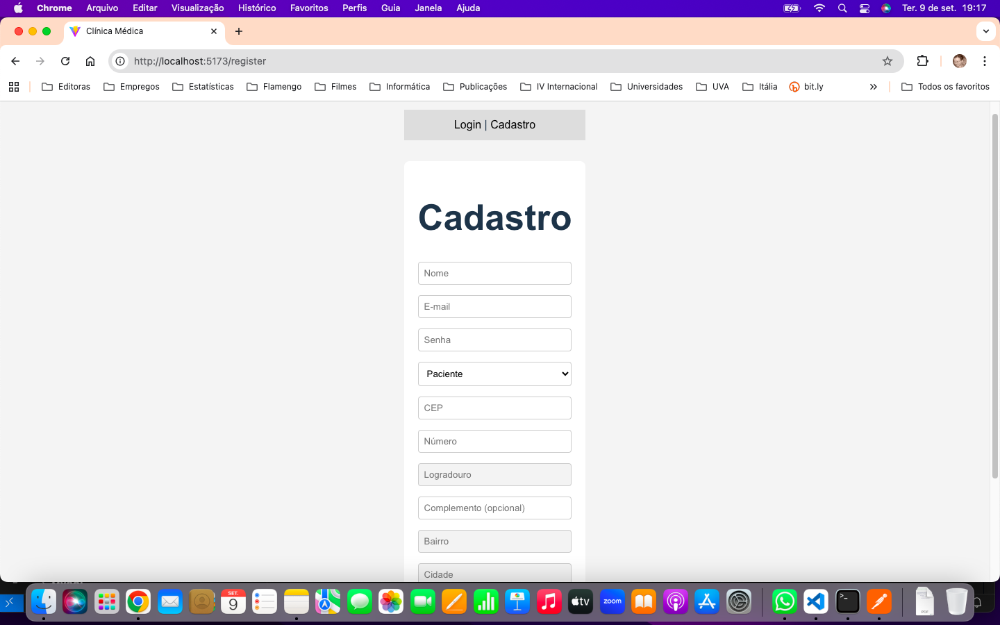
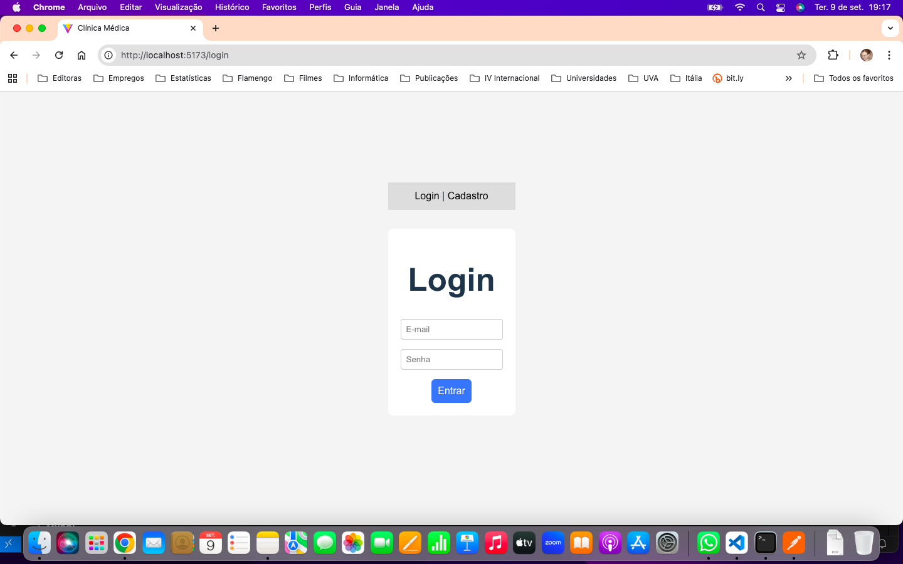
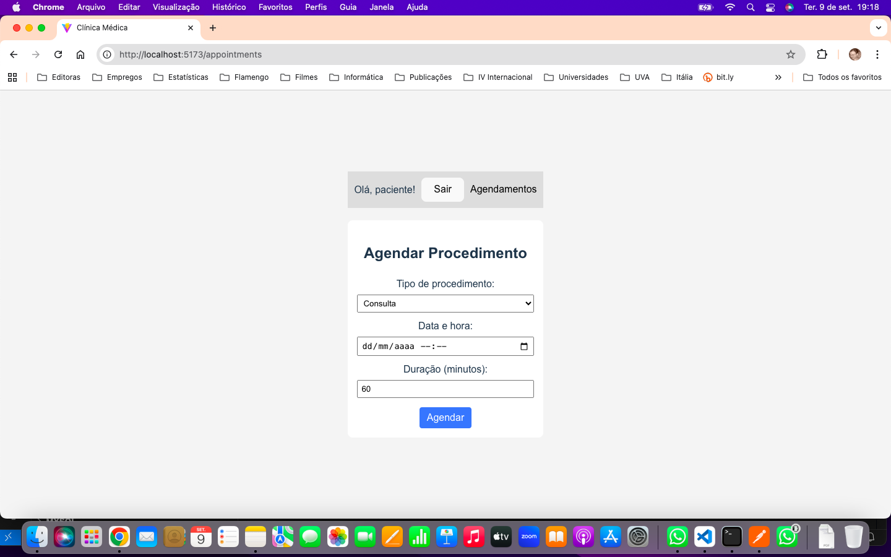
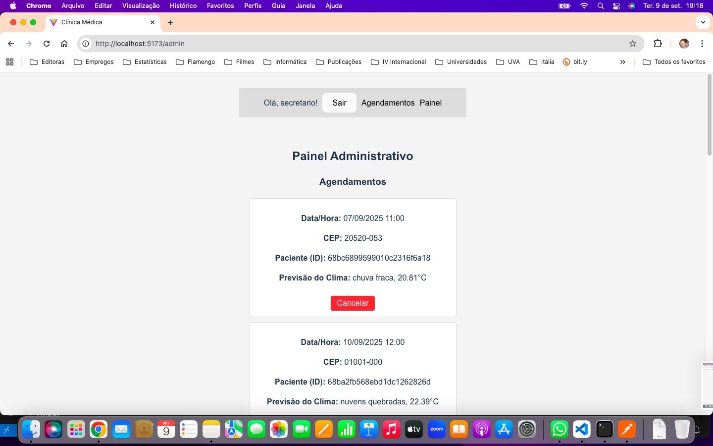

# 🏥 Clínica Médica


Repositório completo contendo o **frontend** e o **backend** da aplicação de gestão de clínica médica.

---

## 💡 Descrição do Projeto

Sistema de agendamento e gerenciamento de procedimentos (consultas e exames) de uma clínica médica. Ele permite o cadastro e login seguro de usuários (pacientes e secretários);
o agendamento de consultas; e o gerenciamento (apenas pelos secretários), num painel administrativo, dos agendamentos (listagem de todos os agendamentos e exclusão dos mesmos).

## 🗂 Estrutura do Projeto

- /backend # API REST (Node.js / Express)
- /frontend # Aplicação cliente (Vue / Vite)
- README.md # Este arquivo

---

## 🚀 Tecnologias Utilizadas

### ⚙️ Backend – API

- Node.js  
- Express  
- MongoDB (Atlas)  
- JWT para autenticação  
- Integração com [ViaCEP](https://viacep.com.br) para preenchimento automático de endereço  
- Integração com [OpenWeatherMap](https://openweathermap.org/) para previsão do tempo nas consultas  

### ⚙️ Frontend – Aplicação Cliente

- Vue (Composition API)  
- Vite  
- Vue Router  
- Axios  
- Validação de formulários e feedback visual  

---

## ⚙️ Como Executar o Projeto

### Backend

```bash
cd backend
npm install
npm run dev      # ou `npm start` para produção
```
A API estará rodando em:
👉 http://localhost:5000 (ou porta configurada no .env)

#### Atenção:

É necessário criar o arquivo .env e colocar as informações correspondentes (indicado em .env.example):

```bash
# Conexão com MongoDB (local ou Atlas)
MONGO_URI=mongodb_connection_string_here

# Chave secreta para JWT
JWT_SECRET=your_jwt_secret_here

# Chave da API de clima (ex.: OpenWeatherMap)
OPENWEATHER_KEY=your_api_key_here

# Porta do servidor
PORT=port-number-here
```

### Frontend

```bash
cd frontend
npm install
npm run dev
````

A aplicação estará disponível em:
👉 http://localhost:5173

## 📌 Regras de Negócio

### 1️⃣ Cadastro de Usuário

| Descrição | Imagens |
|-----------|---------|
| O sistema permite o cadastro de novos usuários com nome, e-mail (formato válido), senha, tipo de usuário (paciente ou secretário) e endereço (preenchimento automático com a API ViaCEP, menos o número e o complemento). O único campo opcional é o complemento. |  |

---

### 2️⃣ Login de Usuário

| Descrição | Imagens |
|-----------|---------|
| O login exige e-mail e senha cadastrados. Caso o usuário seja um paciente, ele será redirecionado à tela de Agendamentos. Caso seja um secretário, será direcionado à tela com as opções de Agendamentos e de Painel Administrativo (com listagem e exclusão de agendamentos). |  |

---

### 3️⃣ Agendamento de Procedimentos

| Descrição | Imagens |
|-----------|---------|
| Permite agendar procedimentos, tanto consultas quanto exames (somente se o dia e o horário estiverem disponíveis e se a data não for no passado). Vale notar que tanto os pacientes quanto os secretários terão acesso à tela de agendamentos (mas não aparecerá a aba Painel para os pacientes). |  |

---

### 4️⃣ Visualização e Exclusão de Agendamentos

| Descrição | Imagens |
|-----------|---------|
| O secretário pode visualizar todos os agendamentos, por ordem de data (da mais antiga para a mais futura). Além disso, pode excluir agendamentos. Vale notar que são exibidos Data/Hora, CEP, Paciente (ID) e a Previsão do Clima (caso disponível), obtida através da API OpenWeatherMap (conforme o CEP). |  |

---

## 🤝 Contribuindo

Clone o repositório:

```bash
git clone https://github.com/danieldmonteiro/clinica-medica.git
```

Crie uma branch com sua feature:

```bash
git checkout -b feature/minha-feature
```
Realize os commits e abra um Pull Request

## 📄 Licença

Sinta-se à vontade para usar, modificar e distribuir!

